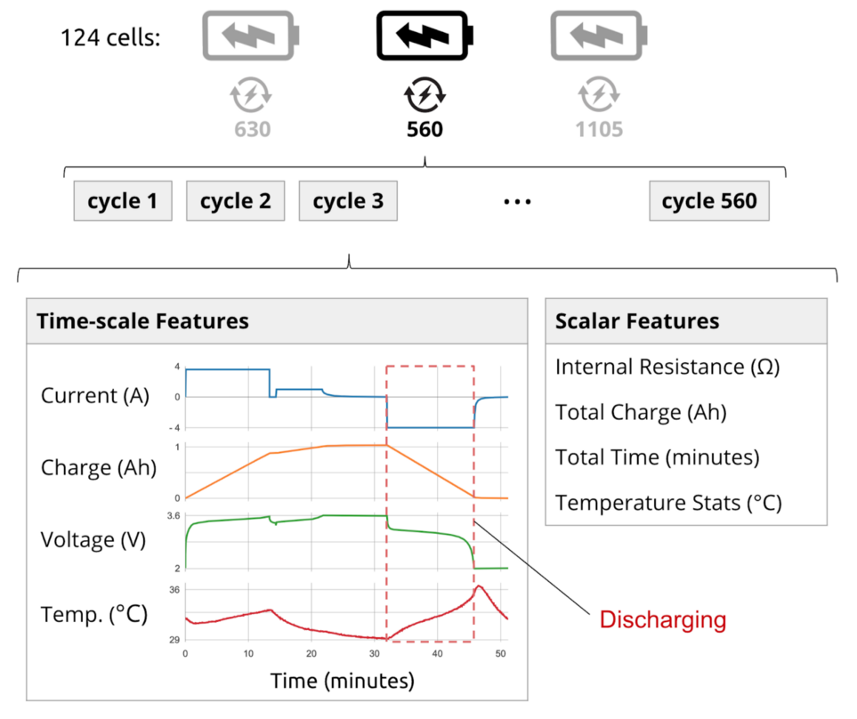
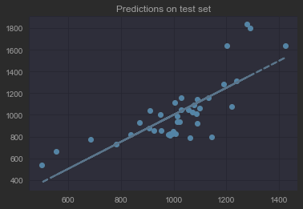

# Can Machine Learning make Lithium-ion Battery manufacturing more sustainable?

**Section 1: Definition**

**Project Overview**

Lithium-ion batteries are utilised widely due to their low and falling costs, high energy densities and long lifetimes. However, developing batteries with a long lifetime entails experimentation of many months to years due to delayed feedback on performance for different chemical compositions. Expensive lab equipment is used to test battery degradation by means of running many batteries through repeated charge and discharge cycles.

To improve research efficiency these experimental workbenches are reproduced many times to increase testing speed.

This is however both expensive, and due to long charge/ recharge cycles still does not reduce testing times where many different chemical compositions must be tested in sequence.

Accurate prediction of battery lifetime using early-cycle data would unlock new opportunities in battery production, use and optimization. For example, manufacturers can accelerate the cell development cycle, perform rapid validation of new manufacturing processes and sort/ grade new cells by their expected lifetime.

This will reduce battery development costs and time as well as improving battery quality by enabling the testing of a wider variety of chemical compositions within the same budget and time.

**Problem Statement**

A low-carbon economy is essential in combating climate change which ranks in the top five priorities of most developed countries’ economic goals.

The discovery and development of novel materials in the field of renewable energy are essential to accelerate the transition to a low-carbon economy.

Technological advancements for which discovery of functional materials is however a prerequisite. The introduction of AI/ ML in the research and development of novel chemical formulations has largely been accepted as a possible means to achieve this objective.

Shorter research times and lower costs of renewable energy sources will result in larger uptake of renewable energy sources which will in effect lead to a faster ramp up to a net-zero economy.

This will be beneficial for a countries’ longer-term sustainability as well as increasing profits for renewable energy manufacturers.

**Solution Statement**

I will use ML/ AI in a twofold manner in this application:

-   Predicting overall battery lifetime during early charge/ discharge cycles (\<50 cycles) – therefore obviating the need to run experiments to full discharge status (approximately 2000 – 5000 cycles).
-   Identifying chemical compositions with a larger probability of resulting in compounds with longer battery life.

The business objectives of:

-   shortening battery testing time and,
-   optimising the probability of finding chemical compounds with longer battery lifetime

    are achieved.

**Benchmark Model**

I will build the model using Python, although many tools could be used e.g., SAS (in which I have more than a decade of experience), Matlab, Julia etc.

The original model presented in the Nature article was built using Matlab. The original model was an Elastic Net ML model. I will use this model as a benchmark to compare my results against.

I will build both a Convolutional Neural Network (CNN) and a Recurrent Neural Neural Network (RNN) using Tensorflow. I intend to use an LSTM RNN with an encoder/ decoder architecture – time permitting. My feeling is that an LSTM model is perfectly suited for this problem as the problem is in essence a time series problem, for which RNNs and their derivations are perfectly suited.

**Evaluation Metrics**

1.  Prediction of battery lifetime (more than predetermined threshold) during first 50 cycles of experiment with an accuracy exceeding 90%.
2.  Reduction of individual battery experiment testing time by a factor of 10.
3.  Automated selection of chemical compounds with an overall accuracy exceeding 80% as compared to human selection of compounds.
4.  Reduction of chemical compound selection time for individual experiments by 50%.

Baseline for 4 business metrics is:

1.  Baseline accuracy for this type of model found in literature is \> 90%. We will start with a simple classifier (Logistic Regression) as a benchmark and then improve the methodology as we progress the project e.g., Convolutional Neural Networks or Elastic Nets.
2.  A reduction in number of cycles by an order of magnitude is directly correlated with reduction in duration. A cycle reduction of an order of magnitude is feasible within existing literature. We will use existing testing times in laboratories as a baseline.
3.  Literature suggests 80% accuracy is an achievable benchmark in this setting. We will start by utilising a simple optimisation algorithm and will progress to use Bayesian optimisation.
4.  We will use existing chemical compound selection time in laboratories as a baseline.

Overall accuracy and Precision are the main measures we are interested in. Sensitivity is less important as there are typically many good candidates, and we are more interested in reducing the False Positive Rate than optimising the True Positive Rate (Specificity)

As mentioned, an accuracy and PPV of greater than 90% is required.

**Project Design**

The following diagram illustrates the MVP for the ML/ AI process:

The product will be designed for the following personas and epic level use cases:

1.  A **battery technologist** performing battery experiments:
-   Analyses/ experimentation should provide increased value to our clients/project.
-   Technologist will work more efficiently by performing experiments faster and more accurately.
1.  A **scientist or operator** writing experiment reports:
-   Will receive experiment reports from technologist much faster.
-   Reduced possibility of errors or mistakes
-   Will spend less time doing frustrating analysis.
-   Will focus on innovative aspects within the project.
-   Job will be more satisfying.
1.  A **business director** selling batteries:
-   Will benefit from Increased revenues.
-   Projects will complete on time.

The predictive model will be implemented in an integrated pipeline in the current experimental workflow as follows:

Continued monitoring and ongoing improvement of the data and model code will be implemented.

-   The model will be operationalised using a CI/CD cloud framework which includes monitoring of data and model shift over time.
-   New code will automatically be pushed to operational systems via a 3-tier development/ staging and operational environment architecture.
-   A/B testing will be utilised to test changes in the development environment.
-   Data drift will be monitored during daily runs on the model via automated thresholds for all parameters to the models.

We will also monitor bias in the model as part of operational deployment and maintenance of the model:

-   Improving data collection, continuing studies on new data sources
-   Continue to work with business to understand the problem domain better.
-   Continue to measure and monitor accuracy against real business outcomes.
-   Continue to update models and data based on abovementioned steps.

**Section 2: Analysis**

**Data Exploration**

There is a lot of data available on the Internet in this domain. I will use a dataset which consists of 124 commercial lithium-ion batteries cycled to failure under fast-charging conditions. This dataset can be found here: <https://data.matr.io/1/>.

This is the largest publicly available dataset for nominally identical commercial lithium-ion batteries.

The following recent paper was (published in Nature based on this data: [Data-driven prediction of battery cycle life before capacity degradation](https://www.nature.com/articles/s41560-019-0356-8) (Severson et al., 2019)

-   The data is available for free.
-   There are no PII issues with this data, it is distributed under the MIT license.
-   Research will be performed on this dataset only. It is deemed to be representative of the problem under study, as discussed within the paper.

The data for this study was for 124 commercial lithium-ion batteries cycled to failure under fast-charging conditions. These lithium-ion phosphate (LFP)/graphite cells, manufactured by A123 Systems (APR18650M1A) represent only one of many different types of batteries and battery form factors that could benefit from this type of model.

Future extensions of the study should consider alternative types of batteries/ battery form factors to improve generalisability of results.

Temperature measurements were not perfectly reliable, and in this setting, this can have a large impact on results.

Future extensions of the study should validate results under varying temperature measurements of higher accuracy.

The choice of labels (response variables) was based on domain knowledge of lithium-ion batteries obtained from literature. The cut-off point for the classification algorithm (\>80th percentile of No. of cycles achieved) was based on literature suggestions and experimentation.

These labels make sense in the context of the problem as one is trying to identify the top performing battery candidates. The decision of what cut-off point to choose is arbitrary, and we experimented with various values to obtain an optimal value.

We load the data used by the original paper by Severson et al. The data associated with each battery (cell) can be grouped into one of three categories: *descriptors*, *summary*, and *cycle*.

-   Descriptors for each battery include *charging policy, cycle life, barcode* and *channel*. Note that barcode and channel are currently not available in this study.
-   Summary data include information on a per-cycle basis, including *cycle number, discharge capacity, charge capacity, internal resistance, maximum temperature, average temperature, minimum temperature,* and *chargetime*.
-   Cycle data include information within a cycle, including *time, charge capacity, current, voltage, temperature, discharge capacity*. We also include derived vectors of *discharge dQ/dV, linearly interpolated discharge capacity (i.e. Qdlin) and linearly interpolated temperature (i.e. Tdlin)*.

The data is stored in hierarchical hash tables with the following structure (as per above classification):

*[battery]*

*[cycle_life]*

*[charge_policy]*

*[summary]*

*[cycles]*

The data could be stored in .pkl files in the original study (code to transform from Matlab to .pkl was provided in published paper). We can see that the data for each cell is presented in a nested structure, with some features only measured once per cycle and others multiple times. Over a full cycle, we have more than a thousand measurements for capacity, temperature, voltage, and current, but only one scalar measurement for other metrics such as internal resistance of the cell or the total cycle time (Hannes Knobloch, Adem Frenk, 2019). The following diagram depicts this relationship.

We split the data into 3 datasets for training, testing (2x datasets) as per the original paper (Severson et al., 2019).

**Exploratory Visualisation**

The code for exploring the data can be found here:

<https://github.com/LourensWalters/battery-cycle-life> (see Data Exploration.ipynb)

We use the training dataset of 46 cells for exploratory analysis. The response variable is “Life Cycle” and has the following distribution:

A battery cell has a minimum cycle life of 534 and maximum of 1227 for this dataset. The data is fairly normally distributed with a slight skew to the right. The dataset is however very small, so it is difficult to infer population statistics from this sample. Mean cycle life is 844 and standard deviation is 184.

Plotting the individual cycles for each cell with respect to discharge capacity yields the graph above. It is clear from this graph that different cells have very different discharge capacity characteristics. Plotting the Voltage against Discharge Capacity for each cycle for a specific cell yields the following graph:

This is known as the discharge curve. It is this curve that was used by the original paper to feature engineer features used within the paper. The features were engineered by subtracting values of the 100th cycle from the 10th cycle. The following curve is obtained in this manner:

The original paper found there is a linear relationship between this variable and the response variable i.e., Cycle Life. The following figure from the original paper illustrates this:

Using a simple Linear model, and these engineered features, the paper achieved the following accuracy results:

Which is not bad for a very simple model. The question is, can we improve on this?

**Algorithms and Techniques**

Our aim is to not perform any feature engineering on this problem, but to rather let the Deep Learning algorithm derive the features. We intend to use the raw data from the charge/ discharge cycles. None of this data were used in the previous models, as only the engineered features were entered into the model.

We decided to build on the work by Knobloch et. al. (Hannes Knobloch, Adem Frenk, 2019) and use a Convolutional Neural Network (CNN) model, without any explicit feature engineering to model the data. We also intend to enhance this model with a Recurrent Neural Network (RNN) as the time series nature of the data suits this model well.

The proposed model looks as follows:

The code for this model can be found here:

<https://github.com/LourensWalters/battery-cycle-life> (see Deep Learning Model.ipynb)

**Benchmark**

Our benchmark is to improve on the results of the original paper:

We start by re-creating the same base models used in the paper i.e., the ElasticNet. We also add a few base models of our own i.e., a Linear and Logistic Regression. Code for these base models can be found here:

<https://github.com/LourensWalters/battery-cycle-life> (see Base Models.ipynb)

Using these base models, we obtained the following results:

It can be observed that the results are fairly similar to the original paper. The Discharge Model does not perform well on the primary test dataset. We need to investigate this further, but am fairly certain that an outlying value could be causing the discrepancy. The following plot confirms this suspicion:

Discharge Model – Primary Test:

On the whole the results are however similar enough for us to continue our study, as the secondary tests confirm.

Variance Model – Secondary Test:

Discharge Model – Secondary Test:

Full Model – Secondary Test:

**Section 3: Methodology**

**Data Preprocessing and Refinement**

We applied the same data cleaning techniques as the original paper (Severson et al., 2019). We removed cycles that had time gaps, small outliers, or other inconsistencies.

We also used the savitzky golay filter to filter out noise in measurements. This helped us recover some data samples that had measuring issues during the experiments – as per the original paper.

Another problem in the data was time. The different charging policies meant that some cycles were finished quicker than others and the time measurements of charge and temperature couldn’t be compared as they were. We resampled the data in a similar fashion as the original paper did:

Take the voltage range during discharging as the reference instead of time by doing the following:

-   Use 3.6V and 2.0V as limits for fully charged and discharged.
-   This range stays constant, even when time doesn’t.
-   Interpolate charge and temperature over voltage.
-   Resample charge and temperature at 1000 equidistant voltage steps.

We used multiple consecutive charging cycles as a single unit of input to the Deep Learning model. As per RNN architecture we refer to these groups of cycles as windows. We defined one target for the whole window.

We tried various parameters and hyperparameters to obtain optimal values for the model. We experimented with various values for window size. We ended up with the size of 20 for our final model.

**Section 4: Results**

**Justification**

We ran the model for 500 epochs. There is a definite improvement in Loss as across epochs. We did not train the model any longer, but we believe there is room for further improvement.

****

Model results in terms of RMSE are as follows:

RMSE_Life Cycle (train): 85.3860

RMSE_Life Cycle (validation): 112.9064

Base Model:

RMSE_Life Cycle (train): 51

RMSE_Life Cycle (validation): 214

We can see that the Deep Learning model generalises better than the base model.

The final model can be accessed here:

<https://github.com/LourensWalters/battery-cycle-life> (see Deep Learning Model Backup.ipynb)

**References**

Hannes Knobloch, Adem Frenk, and W. C. (2019). *Predicting Battery Lifetime with CNNs*. Medium. https://towardsdatascience.com/predicting-battery-lifetime-with-cnns-c5e1faeecc8f

Severson, K. A., Attia, P. M., Jin, N., Perkins, N., Jiang, B., Yang, Z., Chen, M. H., Aykol, M., Herring, P. K., Fraggedakis, D., Bazant, M. Z., Harris, S. J., Chueh, W. C., & Braatz, R. D. (2019). Data-driven prediction of battery cycle life before capacity degradation. *Nature Energy*, *4*(5), 383–391. https://doi.org/10.1038/s41560-019-0356-8
